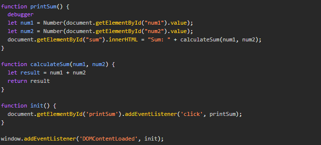

# Dev Tools
## Debugging
1. What was the Bug? The bug is the fact that num1 and num2 are treated as strings so when the addition occurs it concatenates the two variables as strings leading to incorrect results.
2. How would you fix it? The way I would fix this is using the Number constructor and casting the document value into a integer/number first than to pass the variable into the calculate sum function
